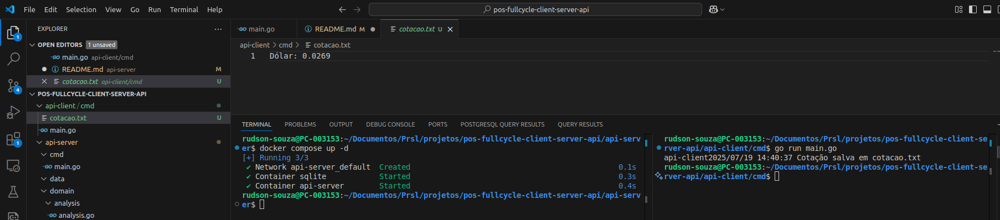

# Go API Server

This project is a simple API server built using Go (Golang). It serves as a starting point for building RESTful services.

## Getting Started

To run the API server, follow these steps:

1. Clone the repository:
   ```
   git clone <repository-url>
   cd pos-fullcycle-client-server-api
   ```

2. Install the dependencies:
   ```
   go mod tidy
   ```

3. Run the server:
   ```
   cd api-server
   docker compose up -d 
   ```

To run the API cliente, follow this step:

1. Run the server:
   ```
   cd pos-fullcycle-client-server-api/api-client/cmd
   go run main.go 
   ```

## API Endpoints

- **GET /cotacao**: Return dollar quote.

## Contributing

Contributions are welcome! Please open an issue or submit a pull request for any enhancements or bug fixes.

## License

This project is licensed under the MIT License. See the LICENSE file for details.

## Review

After analyse your review we run the application again and the file return the dollar quote without problem, as seen in the image below.



Could you run the code again.